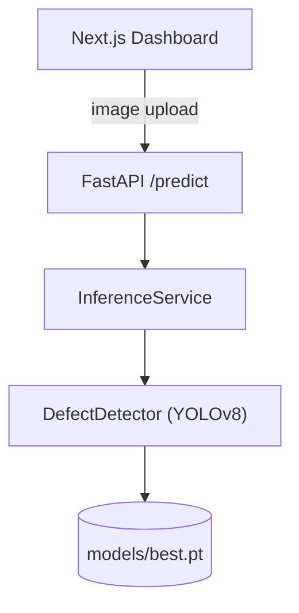

# SteelVision

**AI-powered surface defect detection for stainless steel strips** — a YOLOv8 detector
behind a FastAPI backend and a Next.js inspection dashboard, built around the NEU-DET
surface defect dataset.


*(Replace `OWNER/steelvision` in the CI badge URL above with your actual GitHub path
once pushed — it 404s until then.)*

## Overview

SteelVision detects and classifies surface/edge defects on hot-rolled steel strip
images — the kind of automated visual inspection problem steel mills run on every
production line. Upload an image (or run the live-simulation mode) and get back defect
classes, confidence scores, bounding boxes, an inspection status, and inference latency.

This was built end-to-end (data pipeline, model, API, dashboard, tests, Docker) as a
portfolio project against the **Jindal Stainless Engineering Case Study Competition
2026 — Problem Statement 1**.

## Problem

Manual visual inspection of steel strip surfaces is slow, inconsistent between
inspectors, and doesn't scale to production-line speeds. An automated system needs to:
detect multiple defect types reliably, keep false alarms low, run fast enough to keep up
with a moving line, and present results in a way an operator can act on immediately.

## Solution

1. **Data pipeline** (`ml/preprocessing/`) converts the NEU-DET dataset's VOC-XML
   annotations into YOLO format and splits train/val/test.
2. **YOLOv8n detector** (`ml/training/`, `ml/inference/`) is trained on that data and
   wrapped in a single `DefectDetector` class shared by every consumer.
3. **FastAPI backend** (`backend/`) validates uploads and serves `/predict` with
   structured JSON: classes, confidences, boxes, defect count, severity, latency.
4. **Next.js dashboard** (`frontend/`) uploads images, overlays bounding boxes on the
   original image, and shows a "live inspection simulation" mode.

## Features

- Multi-class defect detection (6 NEU-DET classes) with bounding boxes and confidence
- Per-image inspection summary: status, defect count, severity score, inference time
- Drag-and-drop upload dashboard with an annotated-image overlay
- Live Inspection Simulation mode (clearly labeled — cycles a selected image sequence
  through the same API, not a real camera feed)
- FastAPI REST API with validated inputs and typed responses
- Reproducible training/evaluation pipeline with real, traceable metrics
  (`models/metrics.json` — never hand-typed)
- Model Benchmark dashboard tab: accuracy, latency/FPS, and per-class error analysis,
  read live from the API (`GET /metrics`) — nothing here is a static screenshot
- Independent error analysis (`ml/evaluation/error_analysis.py`): per-class TP/FP/FN via
  IoU matching and a worst-offenders image list, as a cross-check on the training
  framework's own mAP computation
- Dockerized backend + frontend, `docker compose up` to run both
- CI on every push: backend tests + frontend lint/build (`.github/workflows/ci.yml`)
- Optional, clearly-experimental Severstal **segmentation** module — see
  [`docs/segmentation.md`](docs/segmentation.md)

## Architecture



Full request lifecycle and design rationale: [`docs/architecture.md`](docs/architecture.md).

## Tech stack

| Layer | Technology |
|---|---|
| Model | YOLOv8n (Ultralytics), PyTorch |
| Backend | FastAPI, Pydantic, Uvicorn |
| Frontend | Next.js 16 (App Router), React 19, Tailwind CSS v4, TypeScript |
| Data | NEU-DET (VOC-XML → YOLO), OpenCV/Pillow preprocessing |
| Testing | pytest, httpx (FastAPI `TestClient`) |
| Infra | Docker, Docker Compose |

## Dataset

**NEU-DET** — hot-rolled steel strip surface defects, 6 classes (crazing, inclusion,
patches, pitted_surface, rolled-in_scale, scratches), 1,800 images, 200×200 px,
bounding-box annotations. Source, licensing notes, and exact download steps:
[`data/README.md`](data/README.md).

> **This sandbox has no outbound internet access to Kaggle/GitHub**, so this project
> couldn't download NEU-DET itself. The real dataset (1,800 images, verified against the
> counts and class names above) was downloaded separately and copied in at
> `data/raw/NEU-DET/`, then converted with the exact same `ml/preprocessing/prepare_dataset.py`
> documented below — no special-casing. A synthetic placeholder generator
> (`ml/preprocessing/synthetic.py`) is kept as a fallback for environments (like this
> sandbox) with no path to real data; its output and any metrics from it stay clearly
> labeled `synthetic_data: true` everywhere. See [`docs/model.md`](docs/model.md) for
> both paths.

## Model

YOLOv8n, chosen for CPU-friendly production-line latency on a small, low-class-count
detection task. Trained from random initialization (no internet access to COCO-pretrained
weights in this build) for 50 epochs on the real NEU-DET training split. Final verified
test-set metrics: **precision 0.6629, recall 0.5900, F1 0.6243, mAP@0.5 0.6765,
mAP@0.5:0.95 0.3447**, at **63.35 ms mean latency (15.79 FPS)** on CPU. See
[`docs/model.md`](docs/model.md) for the full per-class breakdown — **crazing is the
clear weak point (AP@0.5 = 0.2989, recall = 0.02)** — and exactly how to reproduce or
improve on this.

## Demo

Run locally (below) and open http://localhost:3000 — no hosted demo or screenshots are
included here since none were generated from real inspection runs in this build
environment.

## Installation

```bash
git clone <this-repo>
cd steelvision

# Backend
pip install -r backend/requirements.txt

# Frontend
cd frontend && npm install && cd ..
```

## Running locally

**Without Docker:**

```bash
# Terminal 1 — backend (needs models/best.pt, see models/README.md)
uvicorn backend.main:app --reload --port 8000

# Terminal 2 — frontend
cd frontend
cp ../.env.example .env.local   # sets NEXT_PUBLIC_API_URL
npm run dev
```

Open http://localhost:3000. API docs at http://localhost:8000/docs.

**With Docker:**

```bash
cp .env.example .env
docker compose up --build
```

## API

| Method | Path | Description |
|---|---|---|
| GET | `/health` | Liveness + whether a model is loaded |
| GET | `/model-info` | Architecture, class list, weights path, synthetic flag |
| GET | `/metrics` | Verbatim `models/metrics.json` / `benchmark.json` / `error_analysis.json`, or `null` fields if not yet generated |
| POST | `/predict` | Multipart image upload → detection result |

```bash
curl -X POST http://localhost:8000/predict -F "file=@frontend/public/samples/scratches.jpg"
```

Actual response from this project's real, trained checkpoint (not illustrative):

```json
{
  "status": "DEFECT DETECTED",
  "defect_count": 2,
  "detections": [
    {"class_name": "scratches", "confidence": 0.556, "bbox": {"x_min": 132.3, "y_min": 0.0, "x_max": 163.2, "y_max": 194.4}},
    {"class_name": "scratches", "confidence": 0.253, "bbox": {"x_min": 134.5, "y_min": 0.0, "x_max": 174.5, "y_max": 190.6}}
  ],
  "severity_score": 58.2,
  "inference_ms": 54.43,
  "image_width": 200,
  "image_height": 200,
  "model_name": "best",
  "synthetic_model": false
}
```

`inference_ms` is per-request and varies with machine load; see `models/benchmark.json`
(and the table in `docs/model.md`) for the real, warmed-up latency/FPS distribution.

## Training

**Real data** (recommended — see `data/README.md` to get NEU-DET, then one command runs
convert → train → evaluate → benchmark → error-analysis):

```bash
python scripts/run_real_pipeline.py --epochs 100 --model yolov8n.pt --skip-download
# use --model yolov8n.yaml instead of yolov8n.pt if you also have no internet access to
# Ultralytics' pretrained COCO weights (this project's own build trained that way)
```

**Synthetic fallback** (no real data available):

```bash
python -m ml.preprocessing.synthetic --out data --per-class 40
python -m ml.training.train --model yolov8n.yaml --epochs 20 --name synthetic_smoke_test --synthetic
```

## Evaluation

```bash
python -m ml.evaluation.evaluate --weights models/best.pt --split test
python -m ml.evaluation.benchmark --weights models/best.pt
python -m ml.evaluation.error_analysis --weights models/best.pt --split test
```

Writes real precision/recall/F1/mAP, latency/FPS, and per-class TP/FP/FN to
`models/{metrics,benchmark,error_analysis}.json` — see [`docs/model.md`](docs/model.md)
for the current numbers, and the dashboard's **Model Benchmark** tab to view them live.

## Production deployment

Docker Compose setup, CPU/GPU notes, and exactly how a real industrial camera would feed
frames into this same `/predict` API: [`docs/deployment.md`](docs/deployment.md).

## Optional: Severstal segmentation module (experimental)

A second, pixel-level segmentation pipeline (RLE codec, mask-to-polygon conversion,
YOLOv8-seg training/inference) for the [Severstal Steel Defect Detection](https://www.kaggle.com/competitions/severstal-steel-defect-detection)
dataset lives under `ml/segmentation/`, fully separate from the detection API above.
**It is scaffolded and unit-tested, not trained or verified** — a smoke-training run on
synthetic data came back inconclusive (all metrics exactly 0, cause not yet isolated),
so no segmentation metric is reported anywhere in this project. Full status and how to
pick it up: [`docs/segmentation.md`](docs/segmentation.md).

## Reproducibility

- Every reported number in `docs/model.md` is the direct, unedited output of
  `ml/evaluation/evaluate.py`, `benchmark.py`, or `error_analysis.py` — never hand-typed.
  Re-run them yourself; the checked-in JSON files those scripts write are the only
  source of truth the README and docs draw from.
- Dataset splits are deterministic: `ml/preprocessing/prepare_dataset.py` and
  `synthetic.py` both take `--seed` (default `42`) and split per-class, so re-running
  conversion reproduces the same train/val/test membership.
- Training itself is not bit-exact reproducible on CPU across machines/PyTorch builds
  (Ultralytics sets `deterministic=True` and a training seed by default, but CPU kernel
  nondeterminism and version drift still mean a re-run will land close to, not exactly
  on, the numbers below).
- Exact software versions used for the numbers in `docs/model.md`: Python 3.14.6,
  `torch==2.14.0+cpu`, `torchvision==0.29.0+cpu`, `ultralytics==8.4.146`, run on an
  Intel Core i7-5500U (CPU only, no GPU) — see `backend/requirements.txt` for the full
  pinned dependency floor.

## Limitations

- **Lighting and camera variation.** NEU-DET images are captured under fairly
  consistent lab conditions; a real production line's lighting/camera setup would need
  its own data or fine-tuning.
- **Unseen defect types.** The model only knows the 6 NEU-DET classes — a new defect
  type on a real line would need new labeled data.
- **Domain shift.** A model trained on this dataset's steel grade/finish may not
  generalize to visually different stainless steel products without retraining.
- **Crazing detection is weak** (AP@0.5 = 0.2989, recall = 0.0202 on the real test set) —
  the model misses nearly all real crazing defects. See `docs/model.md` for the
  per-class breakdown and likely causes/fixes.
- **Trained from random initialization, not transfer learning.** This sandbox also has
  no internet access to Ultralytics' COCO-pretrained checkpoints, so `models/best.pt`
  was trained with `yolov8n.yaml` (random weights) rather than `yolov8n.pt`. Transfer
  learning from COCO would very likely improve on the numbers in `docs/model.md` for
  the same epoch budget — retrain with `--model yolov8n.pt` if you have that access.
- **Severity score is a demo heuristic** (see `docs/model.md`), not a validated
  industrial severity standard.
- **No camera integration.** "Live Inspection Simulation" cycles user-selected images
  through the same API; it does not talk to real camera hardware.

## Future improvements

- Real industrial camera integration (GigE/USB3 Vision) feeding `/predict` directly
- ONNX/TensorRT export for lower-latency edge inference
- Multi-camera / multi-station inspection aggregation
- Defect tracking across frames on a moving strip
- Continuous learning from operator-corrected labels
- Full production-line integration (PLC signaling, reject-gate control)

## Repository structure

```text
steelvision/
├── frontend/        Next.js dashboard (Inspection, Live Simulation, Model Benchmark tabs)
├── backend/         FastAPI app (api/, services/, schemas/, main.py)
├── ml/
│   ├── training/, inference/, preprocessing/, evaluation/, configs/   detection (YOLOv8)
│   └── segmentation/    optional, experimental Severstal module (see docs/segmentation.md)
├── data/            dataset docs (raw/processed/train/val/test are git-ignored)
├── data_seg/        segmentation dataset (git-ignored, optional module only)
├── models/          checkpoints + metrics (git-ignored, docs only)
├── scripts/         download_neu_det.py, run_real_pipeline.py (one-command real-data run)
├── tests/           pytest suite
├── docs/            architecture.md, model.md, deployment.md, segmentation.md
├── docker/          Dockerfiles
├── .github/workflows/ci.yml    backend tests + frontend lint/build on every push
└── docker-compose.yml
```

## Author

**Debashis Mohapatra**

## License

MIT — see [`LICENSE`](LICENSE).
