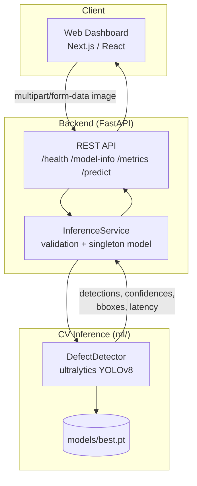

# Architecture

## System overview

## Request lifecycle (`POST /predict`)

1. Frontend uploads an image via `multipart/form-data`.
2. FastAPI's `/predict` route (`backend/api/routes.py`) hands the `UploadFile` to
   `InferenceService.validate_and_load_image` (`backend/services/inference_service.py`):
   content-type allowlist, size cap (10 MB), corrupt-file check.
3. The validated `PIL.Image` goes to `InferenceService.predict`, which calls the shared
   `DefectDetector.predict` (`ml/inference/predict.py`) — the same class used by the CLI
   training/evaluation scripts, so API and offline results can never drift apart.
4. `DefectDetector` runs the loaded YOLOv8 checkpoint, times the forward pass, and maps
   raw boxes into `Detection` objects plus a heuristic severity score.
5. The result is serialized through Pydantic schemas (`backend/schemas/detection.py`)
   and returned as JSON: status, defect count, per-detection class/confidence/bbox,
   severity, inference time, and whether the loaded model was trained on synthetic data.
6. The frontend renders the original image with an SVG/canvas overlay drawn from the
   returned bounding boxes (boxes are never baked into a returned image server-side —
   keeping the API a pure JSON contract).

## Why this split

- **`ml/` is framework-agnostic.** Training, evaluation, and inference logic have no
  FastAPI or Next.js imports, so the same code runs from the CLI, a notebook, or the API.
- **`backend/services/` is the only place that touches both `ml/` and FastAPI**, so
  request validation and error mapping live in one spot instead of being duplicated
  across routes.
- **Single model load per process.** `InferenceService` is instantiated once at import
  time and loaded on FastAPI's startup event, avoiding a model load on every request.

## Live Inspection Simulation

The "live" mode (see `docs/model.md` and the frontend `LiveSimulation` component) is a
client-side loop that calls the same `/predict` endpoint repeatedly against a rotating
set of sample images — there is no camera integration in this build. See
`docs/deployment.md` for how a real industrial camera would plug into this same API.
